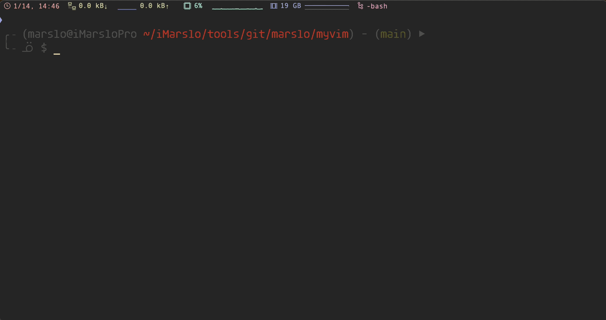

## install
TBD

## plugins

usage/demo and configuration check [vim/plugins](https://marslo.github.io/ibook/vim/plugins.html)

## magic vim

> using vim with fzf/fd/rg/ag

check [devops/awesomeShell](https://marslo.github.io/ibook/devops/awesomeShell.html#magic-vim) for more details
